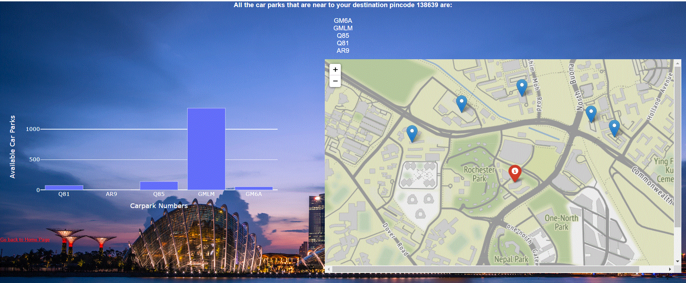

We have worked on a forecasting model for availability of car parks which includes the data of Singapore car parks. Here we are showing prototype of how the actual webapp should look like.

Instructions: 

install all the requirements using requirements.txt

run the app.py using 

​		`python app.py`

open a browser and search for `http://127.0.0.1:5000/`

provide the pincode, day and hour

​		`for example: 138639, 10, 4`

click on `predict` button

That will show `5 nearest car parks` from that pincode and their lot availability

Interface:

